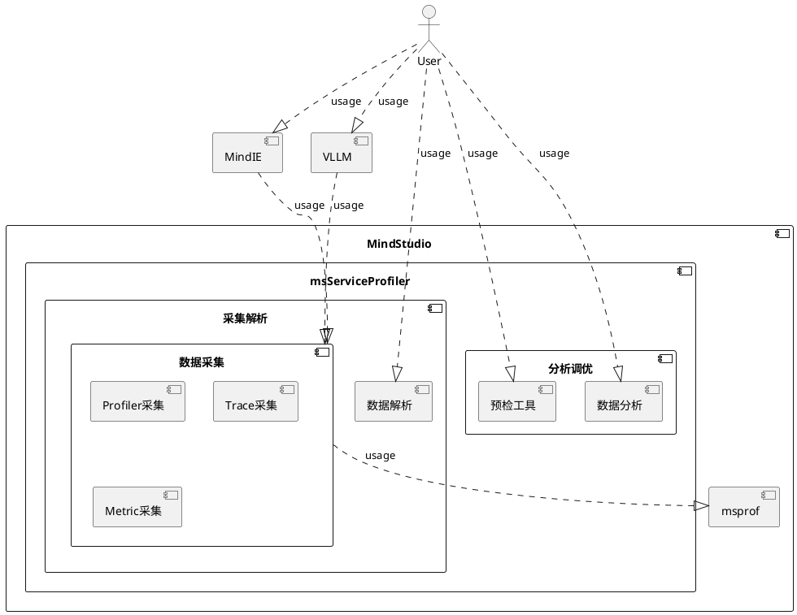

**MindStudio Service Profiler 特性设计说明书**

<table>
    <tr>
        <td>所属SIG组:</td>
        <td>msserviceprofiler</td>
    </tr>
    <tr>
        <td>落入版本:</td>
        <td>26.0.0</td>
    </tr>
    <tr>
        <td>设计人员:</td>
        <td>
            <a href="https://gitcode.com/mjsz11">mjsz11</a> /
            <a href="https://gitcode.com/yaohan404">yaohan404</a> /
            <a href="https://gitcode.com/panyj1993">panyj1993</a> /
            <a href="https://gitcode.com/ChenHuiwen/">ChenHuiwen</a>
        </td>
    </tr>
    <tr>
        <td>日期:</td>
        <td>20260120</td>
    </tr>
</table>

**改版记录**

<table>
    <tr>
        <th>日期</th>
        <th>修订版本</th>
        <th>修订描述</th>
        <th>作者</th>
        <th>审核</th>
    </tr>
    <tr>
        <td>20260120</td>
        <td>0.1</td>
        <td>新增</td>
        <td>
            <a href="https://gitcode.com/mjsz11">mjsz11</a> /
            <a href="https://gitcode.com/yaohan404">yaohan404</a> /
          <a href="https://gitcode.com/panyj1993">panyj1993</a> /
            <a href="https://gitcode.com/ChenHuiwen/">ChenHuiwen</a>
        </td>
        <td>
            <a href="https://gitcode.com/yaohan404">yaohan404</a> /
          <a href="https://gitcode.com/panyj1993">panyj1993</a>
        </td>
    </tr>
</table>

**目录**

# 1. 特性概述

本文档旨在阐述服务化框架监测与性能分析能力的增强方案。随着AI推理应用在企业级场景的快速普及，对推理服务的可观测性提出了更高要求。本方案通过系统化的功能增强，构建了一套覆盖指标监测、链路追踪、性能剖析的端到端可观测性体系，助力客户实现高效的监测、告警、容量规划和性能调优。
本方案的核心价值在于：为推理服务提供生产级可观测能力，帮助企业构建完整的AI运维体系；通过灵活的配置机制和无侵入式采集技术，降低使用门槛；支持多框架统一标准，保证技术方案的可持续演进。
本文档主要包含特性需求分析、功能范围界定、架构设计要点等内容，适用于服务化框架的监测系统开发、测试和运维人员。

## 1.1. 范围

包含推理服务化场景的性能数据采集，数据解析，数据分析等模块。
- **指标监测体系增强**：支持函数执行时间、内部变量、入参出参等自定义指标采集，具备动态启停、自动标签注入能力
- **Trace链路追踪完善**：支持大EP场景Trace采集、自动TraceID生成、多框架链路数据统一解析
- **性能剖析能力扩展**：支持SGLang框架采集、多模态数据处理、投机推理专项剖析
- **易用性优化**：提供命令行控制、快速解析、数据比对、可视化优化等工具链增强
- **标准化建设**：制定服务化采集标准，实现多框架数据统一解析和展示

## 1.2. 特性需求列表

| 需求序号 | 需求名称 | 特性描述 | 备注 |
|---------|---------|---------|------|
| 001 | 支持在线监测大盘（VLLM） | 构筑推理场景在线监测，支持使用Prometheus抓取和可视化vLLM运行时关键指标，用于监测、告警、容量规划和性能调优 | 包含子需求：支持函数执行时间作为metric指标的自定义配置和推送 |
| 002 | 支持metric推送动态启停 | 提供动态启停能力支持按需加载指标，通过修改配置文件控制metrics采集的启停，支持多次启停和配置热更新 | 减小应用运行压力，支持与profiling分开控制 |
| 003 | 支持自动采集dp作为metric的label | 所有自定义metric自动包含dp和role标签，调度进程自动添加实际值，请求进程使用默认值-1，支持负载均衡问题排查 | 重点支持DP负载不均场景 |
| 004 | 支持对同一函数在多处自定义配置 | 支持metric和profiling同时采集同一函数，支持自定义handler编写metric推送函数，提供配置指导 | 确保兼容性和灵活性 |
| 005 | 支持函数内变量以及入参和出参作为metric指标 | 支持获取函数内部变量、输入输出值作为metric值或label，支持简单计算操作（数组长度、字典取值、类型转换等） | 扩展metric采集维度 |
| 006 | 支持vllm核心指标数据监测 | 配置采集TPS、时延统计、时间拆解、BatchSize、输入输出长度等核心指标，在Grafana正确呈现 | 可复用vllm原生metric |
| 007 | 支持投机推理指标数据监测 | 配置采集投机解码相关指标（平均接受步长、接受率、token数量等），在Grafana正确呈现 | 支持投机推理优化场景 |
| 008 | 支持vllm DPLB指标数据监测 | 配置采集DP相关指标（请求长度、block数量分配等），在Grafana正确呈现 | 支持DP负载监测 |
| 009 | 支持在线Trace能力 | 在Motor仓添加Trace采集支持大EP场景，生成spanID与原有TraceID对接，记录traceID到日志 | 包含子需求：支持大EP场景推送Trace信息 |
| 010 | 支持自动生成TraceID | 提供环境变量支持自动生成TraceID，支持概率采样和错误采样机制，增强单独服务的内部监测能力 | 完善Trace采集覆盖场景 |
| 011 | 支持SGLang服务化核心指标采集 | 适配SGLang框架，复用vllm配置逻辑，采集调度执行过程、KVCache、请求队列等关键信息 | 支持新框架深度适配 |
| 012 | 支持SGLang torchprofiler解析 | 在SGLang服务化解析过程中自动使能torch profiler数据解析，支持在Insight中正常可视化 | 完善SGLang profiling能力 |
| 013 | 支持SGLang torchprofiler采集 | 使能SGLang支持通过service profiler控制torchprofiler启停，支持堆栈、内存、采集步数等开关配置 | 复用vllm同等能力 |
| 014 | 支持多模态数据采集 | 首次支持多模态模型profiling数据采集，重点采集文本、图像等数据处理模块的耗时情况 | 支持vLLM-omni多模态版本 |
| 015 | 支持MTP和投机推理数据采集 | 采集投机推理相关数据（token数量、草稿模型推理时间等），在batch csv和trace图中展示 | 支持投机推理优化技术 |
| 016 | 支持torchprofiler采集/解析 | 支持通过torch profiler接口采集数据（支持mindie和vllm框架），自动识别并解析torch profiler数据 | 获取堆栈信息能力 |
| 017 | 使用DB格式减少解析后的数据 | 将算子数据解析改为DB格式，减少磁盘空间使用，提供大数据量告警和配置指导 | 优化数据存储效率 |
| 018 | vllm支持token级采集 | 支持指定采集token数量，基于step函数触发采集启停，确保线程安全和token推理过程采集 | 精确控制采集范围 |
| 019 | 支持条件自动开启算子采集 | 基于metric监测实现自动触发采集，支持按batchsize和发生次数条件触发，支持自动关闭 | 提高工具易用性 |
| 020 | 支持数据比对 | 支持两份服务化数据进行比对，按span名称统计时间差异，生成比对结果CSV文件 | 辅助性能差异分析 |
| 021 | 解析后关键信息汇总 | 支持span导出CSV，提供关键span耗时统计，解析进度提示和汇总报告 | 优化解析体验 |
| 022 | 提供快速解析能力 | 调研关键性能指标，提供快速解析流程，优先展示用户关注的核心数据 | 提升解析效率 |
| 023 | 数据图表展示与数值准确性优化 | 优化数据展示和数值准确性，提升产品化质量 | Q1商发需求 |
| 024 | 提供无侵入自动插桩能力采集vllm数据 | 实现无侵入式数据采集，降低使用门槛 | Q1商发需求 |
| 025 | 服务化落盘数据结构优化 | 变更采集数据格式为可视化slice表，提升解析性能，支持多db同时展示 | 优化数据存储结构 |
| 026 | 服务化采集场景制定采集标准并在不同框架补齐点位 | 制定统一采集标准，规范domain和span定义，对外提供标准接口，统一解析逻辑 | 建立标准化体系 |
| 027 | 可视化泳道排序 | 优化Insight泳道标签和排序，添加进程类型标识，按DP域分组展示，提升可视化效果 | 改善用户体验 |
| 028 | 通过命令行启停profiling | 改用命令行方式控制profiling启停，通过独立进程监听配置变化，提高易用性 | 替代文件修改方式 |

# 2. 需求场景分析

## 2.1. 特性需求来源与价值概述

**需求来源**：随着大模型推理服务在生产环境的广泛应用，金融机构、云服务提供商和企业用户对推理服务的性能监测、故障诊断和优化需求日益迫切。现有监测体系存在数据采集不全面、可视化效果差、易用性不足等问题，无法满足生产环境运维要求。

**价值概述**：
- **对金融机构用户**：提供完整的AI推理全链路监测能力，满足金融行业严格的SLA要求和合规性标准
- **对云服务提供商**：增强vLLM等服务化框架的可观测性，提升服务质量和客户满意度
- **对开发运维团队**：提供精准的性能数据支撑容量规划、性能调优和故障定位
- **竞争力价值**：若无此特性，用户将面临监测盲区、故障定位困难、性能优化缺乏数据支撑等问题，严重影响AI推理服务在生产环境的稳定运行和用户体验

## 2.2. 特性场景分析

### 2.2.1. 1）场景触发条件及对象
**触发条件**：
- 生产环境vLLM推理服务部署后需要持续监测
- 出现性能下降、响应超时等异常情况时
- 进行容量规划、性能优化等主动运维时
- 新框架（如SGLang）接入时需要性能评估

**使用对象**：
- **AI运维工程师**：具备一定的AI推理和运维知识，负责日常监测和故障处理
- **性能优化工程师**：深入理解推理框架架构，进行性能分析和优化
- **算法工程师**：关注模型推理效果和性能表现

### 2.2.2. 2）主要用户应用场景及子场景

**场景一：生产环境实时监测**
- 子场景1.1：核心指标大盘监测
- 子场景1.2：异常自动告警
- 关键操作：配置监测指标、设置告警阈值、查看监测大盘

**场景二：性能问题诊断定位**
- 子场景2.1：Trace全链路跟踪
- 子场景2.2：性能数据深度分析
- 子场景2.3：多维度数据关联分析
- 关键操作：开启 profiling、分析 trace 数据、比对性能差异

**场景三：容量规划与性能优化**
- 子场景3.1：资源使用趋势分析
- 子场景3.2：性能瓶颈识别
- 子场景3.3：优化效果验证
- 关键操作：采集性能基线、分析优化空间、验证优化效果

**场景四：多框架统一监测**
- 子场景4.1：vLLM框架监测
- 子场景4.2：SGLang框架适配
- 子场景4.3：多模态模型支持
- 关键操作：框架配置适配、数据采集验证、统一展示

## 2.3. 特性影响分析

### 2.3.1. 系统位置及周边接口
**系统位置**：位于AI推理服务监测体系的核心层，承接数据采集，支撑可视化展示

**周边接口**：
- **向上接口**：Grafana可视化、APM调用链平台、告警通知系统
- **向下接口**：vLLM推理引擎、SGLang框架、多模态模型
- **水平接口**：Prometheus监测系统、OpenTelemetry标准、Torch Profiler

### 2.3.2. 关键约束及特性冲突
**性能影响约束**：
- 数据采集对推理性能的影响需控制在5%以内
- 大数据量采集时的存储和传输开销需优化

**兼容性约束**：
- 需支持不同版本的vLLM框架
- 需适配多种硬件平台（NPU/GPU）
- 需支持多种部署环境（云环境/本地部署）

### 2.3.3. 与其他需求的交互分析
**正向依赖**：
- 001监测大盘是其他监测功能的基础展示平台
- 009Trace能力为020数据比对提供数据基础
- 026采集标准为多框架支持提供统一规范

**潜在冲突**：
- 详细数据采集与系统性能之间存在平衡需求
- 多框架适配与功能深度之间存在资源分配冲突

### 2.3.4. 平台差异性分析
**硬件平台**：
- 支持昇腾NPU和NVIDIA GPU平台
- 需针对不同硬件特性优化数据采集策略

**操作系统**：
- 支持Linux主流发行版（CentOS、Ubuntu等）
- 容器化部署支持（Docker、Kubernetes）

### 2.3.5. 兼容性分析
**向前兼容**：支持现有vLLM版本的监测数据采集
**向后兼容**：预留接口支持未来新框架的快速接入
**标准兼容**：遵循Prometheus、OpenTelemetry等业界标准

### 2.3.6. 约束及限制
**技术约束**：
- 数据采集不能影响推理服务的核心功能
- 大数据量处理需要优化存储和解析效率

**资源约束**：
- 监测数据存储需要合理的存储空间规划
- 实时数据处理需要足够的计算资源

**使用约束**：
- 部分高级功能需要用户具备一定的技术背景
- 多框架支持需要相应的配置和适配工作

### 2.3.7. 硬件限制

不涉及

### 2.3.8. 技术限制

操作系统：Linux

编程语言：python

### 2.3.9. 对License的影响分析

不涉及

### 2.3.10. 对系统性能规格的影响分析

不涉及，同服务化规格

### 2.3.11. 对系统可靠性规格的影响分析

不涉及

### 2.3.12. 对系统兼容性的影响分析

操作系统：Linux

编程语言：python3.8 以上

### 2.3.13. 与其他重大特性的交互性，冲突性的影响分析

不涉及

## 2.4. 同类社区/商用软件实现方案分析

### 2.4.1. 社区开源方案分析

**Prometheus + Grafana 生态**
- **实现机制**：基于exporter模式，通过vLLM-exporter采集指标，Prometheus拉取存储，Grafana可视化
- **优势**：生态系统成熟，社区活跃，部署相对简单
- **劣势**：
  - 监测维度有限，主要面向系统级和基础应用指标
  - 缺乏针对AI推理场景的专用指标（如token级耗时、投机推理指标等）
  - 无法实现代码级性能分析和Trace跟踪
  - 需要自行开发和维护exporter

**OpenTelemetry (OTel)**
- **实现机制**：通过OTel SDK自动插桩，采集Trace、Metric、Log数据
- **优势**：业界标准，多语言支持，良好的可扩展性
- **劣势**：
  - 对AI推理框架的专门适配不足
  - 缺乏针对vLLM、SGLang等框架的预置插桩点
  - 可视化能力相对基础，需要结合其他工具

**PyTorch Profiler**
- **实现机制**：基于PyTorch框架内置的profiling接口
- **优势**：深度集成PyTorch，算子级性能分析能力强
- **劣势**：
  - 仅限于PyTorch模型，框架耦合度高
  - 缺乏服务化层面的监测（如请求调度、资源管理等）
  - 生产环境部署开销较大

### 2.4.2. 商用软件方案分析

**Datadog APM**
- **实现机制**：基于agent的自动插桩，结合AI专项监测功能
- **优势**：
  - 开箱即用的AI推理监测仪表板
  - 支持多种AI框架和云服务平台
  - 告警和自动化功能完善
- **劣势**：
  - 商业许可费用较高
  - 对国产AI芯片和框架支持有限
  - 数据存储在第三方，存在安全和合规风险

**Dynatrace AI Observability**
- **实现机制**：基于OneAgent的全栈监测，结合AI专用分析引擎
- **优势**：
  - 自动化根因分析能力强
  - 支持AI模型性能退化检测
  - 企业级可靠性和安全性
- **劣势**：
  - 配置复杂，学习成本高
  - 对开源AI框架的深度支持不足
  - 定制化能力有限

**Weights & Biases (W&B)**
- **实现机制**：专注于MLOps的实验跟踪和模型监测
- **优势**：
  - 模型实验管理功能强大
  - 支持模型版本对比和性能分析
  - 开发者社区活跃
- **劣势**：
  - 生产环境推理监测相对薄弱
  - 缺乏服务化框架的深度集成
  - 实时监测能力有限

### 2.4.3. 优劣性对比分析

| 特性维度 | 本方案 | 社区方案 | 商用方案 |
|---------|--------|----------|----------|
| **监测深度** | **代码级+服务级**全栈监测 | 主要为系统级和基础应用监测 | 应用级监测为主，代码级有限 |
| **AI框架适配** | **深度定制**vLLM、SGLang等 | 通用监测，需要自行适配 | 主流框架支持，定制有限 |
| **性能开销** | **可控优化**，目标<5% | 因框架而异，通常较高 | 商业化优化，但agent较重 |
| **Trace能力** | **原生支持**大EP场景Trace | 需要复杂配置和开发 | 功能完善但配置复杂 |
| **多模态支持** | **首次支持**多模态模型监测 | 基本不支持 | 部分支持，但深度有限 |
| **投机推理监测** | **专项支持**投机推理指标 | 无专门支持 | 无专门支持 |
| **国产化支持** | **全面支持**昇腾等国产硬件 | 支持有限 | 支持有限或需额外费用 |
| **成本效益** | **开源基础**+商业增强 | 完全免费但功能有限 | 功能全面但费用高昂 |
| **定制灵活性** | **高度可定制**，源码可控 | 可定制但需要较强技术能力 | 定制受限，依赖厂商 |

### 2.4.4. 本方案的核心竞争优势

**技术深度优势**：
- 针对AI推理场景的深度优化，涵盖从请求调度到算子执行的全链路监测
- 支持token级精细监测和投机推理等专项优化技术监测
- 多框架统一监测架构，避免监测碎片化

**成本优势**：
- 基于开源技术栈，避免高昂的商业软件许可费用
- 针对国产化环境的专门优化，降低技术依赖风险

**易用性优势**：
- 开箱即用的监测配置和可视化仪表板
- 智能化的异常检测和根因分析能力
- 统一的配置管理接口，降低运维复杂度

**生态整合优势**：
- 与华为云APM、Insight等产品深度集成
- 支持行业标准（Prometheus、OpenTelemetry等）
- 为金融、政务等特定行业提供合规性支持

本方案在AI推理监测领域实现了技术深度与实用性的平衡，既避免了开源方案的功能碎片化问题，又克服了商用方案的成本高昂和定制困难等缺点，为AI推理服务在生产环境的稳定运行提供了全面可靠的监测保障。

# 3. 特性/功能实现原理
## 3.1. 目标

用于指导性能工具的研发、测试及后续优化。本工具聚焦于推理服务化的性能数据采集、解析、分析及自动化优化，旨在提升推理效率、降低资源消耗。

## 3.2. 总体方案

* 数据采集：针对推理服务化业务，提供了PYTHON和C++数据高性能，高易用性的采集接口，提供了通用的采集语义。同时提供了硬件的采集能力。并提供自动启停，精细化采集控制等功能
* 数据解析：提供采集数据解析功能，生成基本的表格，timeline 等数据，方便用户进行性能分析
* 数据分析：提供数据的分析功能，对比不同框架数据，辅助用户快速定位问题

# 4. 支持函数执行时间作为 metric 指标的自定义配置和推送

### 4.0.1. 设计思路
通过YAML配置文件定义需要采集的函数执行时间指标，支持环境变量控制是否启用。在目标函数执行前后插入计时逻辑，计算耗时并转换为Histogram类型的Metrics数据。支持自定义Metric名称和Histogram桶的边界配置，通过Prometheus客户端库将数据暴露给Prometheus抓取。

### 4.0.2. 约束条件
1. 需要确保计时逻辑对原函数性能影响最小化
2. Histogram桶配置需要在应用启动时确定，运行时不可修改

---

# 5. 支持 metric 推送动态启停

### 5.0.1. 设计思路
复用profiling配置文件机制，增加metrics采集的启停控制字段。通过文件监听或信号机制实现动态配置重载。启动独立配置管理线程监测配置文件变化，通过线程安全的标志位控制数据采集的启停，确保配置变更能够实时生效。

### 5.0.2. 约束条件
1. Metric配置信息（如bucket）在运行时不可修改，只能启停采集
2. 配置变更到生效可能有毫秒级延迟

---

# 6. 支持自动采集dp作为 metric 的label

### 6.0.1. 设计思路
在所有自定义Metric的Label中固定包含dp和role字段。调度进程在Metric采集时自动获取当前dp信息和PD角色，请求进程统一使用默认值"-1"。通过上下文传递机制在函数调用链中携带dp和role信息，确保开始Benchmark后调度相关指标能正确标注。

### 6.0.2. 约束条件
1. 启动阶段的Metric可能无法获取dp和role信息
2. 需要vLLM调度进程支持dp和角色信息获取接口

---

# 7. 支持对同一函数在多处自定义配置

### 7.0.1. 设计思路
采用配置合并策略，允许同一函数同时配置profiling和metric采集。为每种采集类型建立独立的处理管道，避免相互干扰。支持自定义Metric推送函数，提供模板和指导文档，用户可编写特定逻辑处理复杂Metric计算和推送需求。

### 7.0.2. 约束条件
1. 同一函数的多次配置不能产生冲突的Metric名称
2. 自定义handler需要确保线程安全

---

# 8. 支持函数内变量以及入参和出参作为 metric 指标的自定义配置和推送

### 8.0.1. 设计思路
扩展配置语法支持变量提取表达式，可获取函数输入输出、内部变量。内置简单计算引擎支持数组长度、字典取值、属性访问、基本运算等操作。计算结果可作为Metric值或Label值，通过Prometheus标准格式输出。

### 8.0.2. 约束条件
1. 变量提取可能增加函数执行开销
2. 复杂计算表达式可能影响性能

---

# 9. 支持vllm核心指标数据监测

### 9.0.1. 设计思路
通过配置化方式采集TPS、时延统计、时间拆解等核心指标。复用vLLM原生Metric机制，补充缺失的监测点位。在Grafana中构建统一监测面板，对各类指标进行可视化展示，支持多维度查询和告警配置。

### 9.0.2. 约束条件
1. 需要vLLM版本支持相应的内部接口
2. 部分深度监测可能对性能有轻微影响

---

# 10. 支持投机推理指标数据监测

### 10.0.1. 设计思路
在投机推理关键路径插入监测点位，采集接受步长、接受率、token数量等指标。通过Histogram和Counter类型Metric记录统计数据，在Grafana中构建专用监测面板，实时展示投机推理效果。

### 10.0.2. 约束条件
1. 需要投机推理功能已启用且正常运行
2. 监测点位需要与投机推理算法版本匹配

---

# 11. 支持vllm DPLB指标数据监测

### 11.0.1. 设计思路
监测每个DP的请求长度分布和block分配情况。通过Gauge类型Metric记录实时数值，结合dp标签实现多DP数据分离。在Grafana中构建负载均衡监测面板，辅助DP负载不均问题排查。

### 11.0.2. 约束条件
1. 需要多DP环境支持
2. Block统计需要vLLM内部数据结构支持

---

# 12. 支持大EP场景推送Trace信息

### 12.0.1. 设计思路
在Motor仓集成Trace采集SDK，生成spanID并与原TraceID关联传递到LLM仓。采用异步日志记录方式，将trace信息写入指定级别日志文件，确保大EP场景下的性能和可靠性。

### 12.0.2. 约束条件
1. 需要与现有日志系统兼容
2. 大EP场景可能增加日志存储压力

---

# 13. 支持自动生成TraceID

### 13.0.1. 设计思路
提供环境变量控制自动Trace生成，支持概率采样和错误采样两种策略。采样配置通过环境变量设置，在请求处理开始时判断是否需要进行Trace采集，确保采样结果符合预期。

### 13.0.2. 约束条件
1. 自动生成的TraceID需要保证全局唯一性
2. 采样率配置需要谨慎设置，避免性能影响

---

# 14. 支持SGLang服务化核心指标采集

### 14.0.1. 设计思路
重构vLLM配置逻辑使其支持SGLang框架，采集调度执行过程、KVCache和请求队列等关键信息。通过适配层将SGLang特有数据转换为标准Trace格式，确保在Insight中正常展示。

### 14.0.2. 约束条件
1. 需要SGLang框架提供必要的监测接口
2. 数据格式需要与现有解析逻辑兼容

---

# 15. 支持SGLang trochprofiler 解析

### 15.0.1. 设计思路
在SGLang服务化解析流程中自动识别并解析torch profiler数据。调用torch原生解析接口处理数据，转换为Insight可识别的格式，确保性能数据能够正确可视化。

### 15.0.2. 约束条件
1. 需要torch profiler数据格式稳定
2. 解析过程可能增加处理时间

---

# 16. 支持SGLang trochprofiler 采集

### 16.0.1. 设计思路
扩展service profiler控制接口，支持SGLang框架下的torch profiler启停控制。复用vLLM的配置机制，支持堆栈、内存、采集步数等参数配置，确保功能一致性。

### 16.0.2. 约束条件
1. 需要SGLang支持torch profiler集成
2. 采集开关需要确保线程安全

---

# 17. 支持多模态数据采集

### 17.0.1. 设计思路
针对多模态模型特点，在文本、图像等处理模块的关键路径插入采集点位。通过配置文件定义采集阶段和指标，在timeline上展示各模块耗时情况，支持Qwen2.5-omni-3B等模型。

### 17.0.2. 约束条件
1. 需要多模态模型版本支持
2. 图像处理等特殊模块可能需要定制采集逻辑

---

# 18. 支持MTP和投机推理数据采集

### 18.0.1. 设计思路
在投机推理关键路径采集token数量、接受数量、草稿模型推理时间等指标。通过Batch CSV记录请求级数据，在trace图中标识投机推理耗时，支持多种草稿模型类型。

### 18.0.2. 约束条件
1. 需要投机推理功能正常启用
2. 数据采集需要与推理过程同步进行

---

# 19. 支持 trochprofiler 采集/解析

### 19.0.1. 设计思路
为mindie和vLLM框架集成torch profiler采集接口，支持数据采集和自动识别。调用torch profiler解析能力处理数据，确保在Insight中能够正常可视化和分析。

### 19.0.2. 约束条件
1. 需要PyTorch版本兼容
2. 大量数据采集可能影响性能

---

# 20. 使用DB格式减少解析后的数据

### 20.0.1. 设计思路
将算子数据解析输出格式从JSON改为更紧凑的DB格式。增加解析前提示和告警机制，当数据量过大时建议用户避免生成JSON格式。通过格式优化显著减少磁盘空间占用。

### 20.0.2. 约束条件
1. DB格式需要与现有工具链兼容
2. 格式变更需要充分的版本过渡期

---

# 21. vllm支持token级采集

### 21.0.1. 设计思路
基于服务化框架的step函数机制实现token数量控制的采集。在token推理关键节点插入采集控制逻辑，确保线程安全且能准确采集目标token范围的算子数据。

### 21.0.2. 约束条件
1. 需要准确的token计数机制
2. 采集控制需要与推理过程精确同步

---

# 22. 支持条件自动开启算子采集

### 22.0.1. 设计思路
监测metric中的batchsize指标，当满足指定条件（大小和次数）时自动触发算子采集。结合现有的时间和token控制机制实现自动关闭，提高工具易用性。

### 22.0.2. 约束条件
1. 需要metric监测系统正常运行
2. 条件触发可能有轻微延迟

---

# 23. 支持数据比对

### 23.0.1. 设计思路
开发数据比对命令，输入两个采集文件路径，按span名称进行时间统计比对。输出CSV格式结果，包含AVG、P50、P90等统计值和差值计算，支持性能差异分析。

### 23.0.2. 约束条件
1. 比对的采集数据需要具有相同的span结构
2. 大规模数据比对可能耗时较长

---

# 24. 解析后关键信息汇总

### 24.0.1. 设计思路
提供span数据直接导出CSV功能，解析完成后生成关键span耗时统计信息。包括最长请求分析、各阶段耗时均值/P90等统计值，并在解析过程中显示进度条，提升用户体验。

### 24.0.2. 约束条件
1. 关键span需要明确定义和标识
2. 进度估计需要准确的性能基准数据

---

# 25. 提供快速解析能力

### 25.0.1. 设计思路
分析mindie和vLLM用户最关注的性能指标，建立快速解析流程。优先提取和展示关键性能数据，后续进行完整解析，平衡响应速度和数据完整性。

### 25.0.2. 约束条件
1. 快速解析可能无法包含所有细节数据
2. 需要明确关键指标的优先级

---

# 26. 服务化落盘数据结构优化

### 26.0.1. 设计思路
将采集数据直接存储为可视化slice表格式，避免中间转换。优化数据库索引提升查询性能，确保数据可直接在MindStudio Insight中展示，减少数据拷贝开销。

### 26.0.2. 约束条件
1. 数据结构变更需要与Insight前端兼容
2. 需要保证大量数据写入的性能

---

# 27. 服务化采集场景制定采集标准并在不同框架补齐点位

### 27.0.1. 设计思路
制定统一的采集标准规范，定义核心domain、span名称和属性。在vLLM框架中补齐标准点位，优化解析代码支持标准格式，提供枚举值接口方便用户使用。

### 27.0.2. 约束条件
1. 标准制定需要兼顾各框架特性
2. 点位补齐需要框架版本支持

---

# 28. 可视化泳道排序

### 28.0.1. 设计思路
为服务化数据泳道添加调度进程/推理进程标签，支持hostname和dp域标注。按DP域分组排序，统一展示逻辑，提升可视化界面的可读性和问题定位效率。

### 28.0.2. 约束条件
1. 需要采集数据包含足够的进程标识信息
2. 排序逻辑需要适应不同部署场景

---

# 29. 通过命令行启停profiling

### 29.0.1. 设计思路
开发独立配置管理进程，通过命令行接口控制profiling启停。采用共享内存或进程间通信机制通知用户进程配置变化，避免频繁文件读写，提升易用性。

### 29.0.2. 约束条件
1. 需要确保进程间通信的可靠性
2. 命令行控制需要权限管理机制

# 30. 可靠性&可用性设计

## 30.1. 冗余设计

**不涉及** - 本特性为监测数据采集功能，属于可观测性组件，不涉及业务数据存储和系统核心功能。监测数据的丢失不会影响vLLM核心推理服务的正常运行。

## 30.2. 故障管理

### 30.2.1. 故障检测
1. **采集进程状态监测**：通过心跳机制监测数据采集进程的运行状态
2. **配置有效性检查**：配置文件加载时进行语法和语义校验，避免错误配置生效
3. **数据采集异常检测**：监测指标采集的成功率，异常时记录详细日志

### 30.2.2. 故障隔离
1. **采集模块隔离**：各采集模块（metric、profiling、trace）相互独立，单模块故障不影响其他功能
2. **资源隔离**：采集过程使用独立的内存缓冲区，避免影响vLLM核心业务性能

### 30.2.3. 故障恢复
1. **自动重试机制**：对于临时性采集失败，支持有限次数的自动重试
2. **优雅降级**：在资源紧张时，自动暂停非关键数据的采集，保障核心监测功能
3. **配置热重载**：支持配置动态更新，无需重启服务即可恢复异常配置

### 30.2.4. 告警设计
1. **关键故障告警**：采集进程异常退出、配置加载失败等关键故障触发告警
2. **性能异常告警**：采集过程占用资源超过阈值时告警

## 30.3. 过载控制设计

### 30.3.1. 流量检测与控制
1. **数据量监测**：实时监测采集的数据量，设置内存使用上限
2. **分级降级策略**：
   - 轻度过载：优先降级低频次采集项
   - 中度过载：暂停profiling等大数据量采集，保留核心metric
   - 重度过载：仅保留最关键的运行状态指标

### 30.3.2. 限速机制
1. **采集频率限制**：支持配置各监测项的最小采集间隔，避免过度采集
2. **数据采样控制**：支持概率采样，在数据量过大时自动启用
3. **队列缓冲区管理**：设置合理的采集数据缓冲区大小，满时丢弃最旧数据

### 30.3.3. 优先级保障
1. **核心指标优先**：TPS、时延等关键业务指标享有最高采集优先级
2. **故障数据优先**：错误、异常相关的监测数据优先采集和上报

## 30.4. 升级不中断业务

### 30.4.1. 兼容性设计
1. **配置向后兼容**：新版本支持旧版配置文件格式，自动适配新增字段
2. **数据格式兼容**：采集数据格式保持版本兼容，确保解析工具能够正确处理
3. **API接口稳定**：对外暴露的监测接口保持稳定，变更时提供过渡期

### 30.4.2. 热升级支持
1. **动态库加载**：采集模块支持动态加载和卸载，实现不停机升级
2. **配置保持**：升级过程中保持现有配置状态，升级后自动恢复

### 30.4.3. 回退机制
1. **版本回滚**：支持快速回退到前一稳定版本
2. **配置备份**：升级前自动备份当前配置，回退时自动恢复

## 30.5. 人因差错设计

### 30.5.1. 操作安全
1. **高危操作确认**：profiling启停、配置重置等操作需要二次确认
2. **操作审计日志**：所有配置变更和关键操作记录详细审计日志
3. **权限分级控制**：区分只读监测用户和配置管理用户权限

### 30.5.2. 配置防护
1. **配置语法校验**：YAML配置文件加载时进行严格校验，错误配置拒绝加载
2. **取值范围检查**：数值型参数进行合理范围校验，避免极端值影响系统
3. **配置备份恢复**：支持配置版本管理和一键恢复功能

### 30.5.3. 错误预防
1. **配置模板**：提供标准配置模板，降低配置复杂度
2. **实时预览**：配置变更后提供采集效果预览，确认无误后生效
3. **操作指引**：关键操作提供详细的步骤指引和风险提示

## 30.6. 故障预测预防设计

### 30.6.1. 健康状态监测
1. **自监测指标**：采集组件自身的运行状态指标（内存使用、队列深度等）
2. **性能趋势分析**：监测采集性能变化趋势，预测潜在问题
3. **资源使用预警**：提前预警磁盘空间、内存等资源不足情况

### 30.6.2. 预防性维护
1. **定期自检**：定时执行组件健康状态自检，发现问题提前处理
2. **容量规划**：根据数据增长趋势提供容量规划建议
3. **性能优化建议**：基于运行数据提供配置优化建议

### 30.6.3. 数据质量保障
1. **数据完整性检查**：定期检查采集数据的完整性和一致性
2. **采集延迟监测**：监测数据采集的实时性，延迟过大时告警
3. **异常模式检测**：通过机器学习检测采集数据的异常模式

# 31. 特性非功能性质量属性相关设计

## 31.1. 可测试性

### 31.1.1. 测试方向
1. **功能正确性测试**：验证各监测指标采集的准确性和完整性
2. **性能影响测试**：测试采集功能对vLLM推理性能的影响（P99延迟增加<5%）
3. **稳定性测试**：长时间运行测试，验证内存泄漏和资源回收

### 31.1.2. 边界值测试
1. **配置边界**：测试YAML配置的极端值（如超长metric名称、异常bucket设置）
2. **数据量边界**：测试高并发、大数据量场景下的采集稳定性
3. **资源边界**：测试在系统资源紧张时的降级行为

### 31.1.3. 异常场景测试
1. **配置错误**：测试错误配置文件的容错处理
2. **进程异常**：测试采集进程异常退出后的恢复机制
3. **网络异常**：测试Prometheus连接失败时的数据缓冲和处理

## 31.2. 可服务性

### 31.2.1. 运维文档
1. **部署指南**：提供详细的安装配置说明和最佳实践
2. **故障排查手册**：包含常见问题诊断步骤和解决方案
3. **性能调优指南**：指导如何根据业务场景优化采集配置

### 31.2.2. 监测告警
1. **健康检查接口**：提供RESTful接口用于服务状态检查
2. **关键指标监测**：对采集服务自身的运行状态进行监测告警
3. **日志分级**：支持DEBUG/INFO/WARNING/ERROR分级日志，便于问题定位

### 31.2.3. 维护工具
1. **配置验证工具**：提供配置语法和语义校验工具
2. **数据采样工具**：支持临时性数据采集用于问题分析
3. **性能分析工具**：内置采集性能分析功能

## 31.3. 可演进性

### 31.3.1. 架构设计
1. **插件化架构**：支持新的监测指标类型通过插件方式扩展
2. **配置驱动**：大部分功能通过配置实现，减少代码修改需求
3. **接口抽象**：采集、处理、输出各层接口清晰，便于功能扩展

### 31.3.2. 版本规划
1. **功能模块化**：各子需求独立实现，支持按需部署
2. **向后兼容**：新版本保证旧配置和数据的兼容性
3. **渐进式升级**：支持功能灰度发布和A/B测试

## 31.4. 开放性

### 31.4.1. 标准接口
1. **Prometheus标准**：监测指标输出符合Prometheus数据格式标准
2. **OpenTelemetry兼容**：Trace数据支持OpenTelemetry标准格式
3. **RESTful API**：配置管理接口符合RESTful设计规范

### 31.4.2. 集成能力
1. **多框架支持**：架构设计支持vLLM、SGLang等多种推理框架
2. **可扩展数据源**：支持添加新的数据采集来源
3. **输出格式扩展**：除Prometheus外，支持其他监测系统数据格式

## 31.5. 兼容性

### 31.5.1. 版本兼容
1. **配置兼容**：新版本兼容旧版配置文件格式，废弃参数有明确提示
2. **数据兼容**：采集数据格式保持向前兼容，确保历史数据可解析
3. **API兼容**：对外接口变更提供过渡期和版本标识

### 31.5.2. 环境兼容
1. **多版本vLLM支持**：适配vLLM主要版本，核心接口保持稳定
2. **Python版本兼容**：支持Python 3.8+主要版本
3. **操作系统兼容**：支持主流Linux发行版

## 31.6. 可伸缩性/可扩展性

### 31.6.1. 水平扩展
1. **分布式采集**：支持多实例协同采集，通过标签区分数据来源
2. **负载均衡**：采集任务支持动态分配，避免单点瓶颈
3. **数据分片**：大数据量场景支持按时间或业务维度分片采集

### 31.6.2. 垂直扩展
1. **资源弹性**：采集资源使用支持动态调整，适应不同规模场景
2. **性能优化**：支持采集频率、精度等参数按需调整
3. **存储优化**：支持采集数据压缩和归档策略

## 31.7. 可维护性

### 31.7.1. 诊断能力
1. **详细日志**：关键操作记录详细日志，包含请求ID便于追踪
2. **运行指标**：采集服务自身暴露运行状态指标，用于监测诊断
3. **调试模式**：支持开启详细调试信息，便于问题定位

### 31.7.2. 维护接口
1. **动态配置**：支持运行时配置更新，无需重启服务
2. **状态查询**：提供丰富的状态查询接口，了解各采集模块运行情况
3. **一键诊断**：集成自动化诊断工具，快速识别常见问题

### 31.7.3. 文档完备
1. **代码注释**：核心代码有详细注释，说明设计意图和实现逻辑
2. **架构文档**：提供系统架构和模块设计文档
3. **变更记录**：维护详细的版本变更记录和兼容性说明

# 32. 数据结构设计（可选）

无

# 33. 参考资料清单

**表目录**

<!-- 表X：特性场景相关性分析

表X：特性需求列表
-->
**图目录**

<!-- 图X：方案总体实现原理图

图X：样图：处理流程示意图 -->

**List of abbreviations**  **缩略语清单** ：

| Abbreviations 缩略语 | Full spelling 英文全名 | Chinese explanation 中文解释 |
| -------------------- | ---------------------- | ---------------------------- |
| -                    | -                      | -                            |
